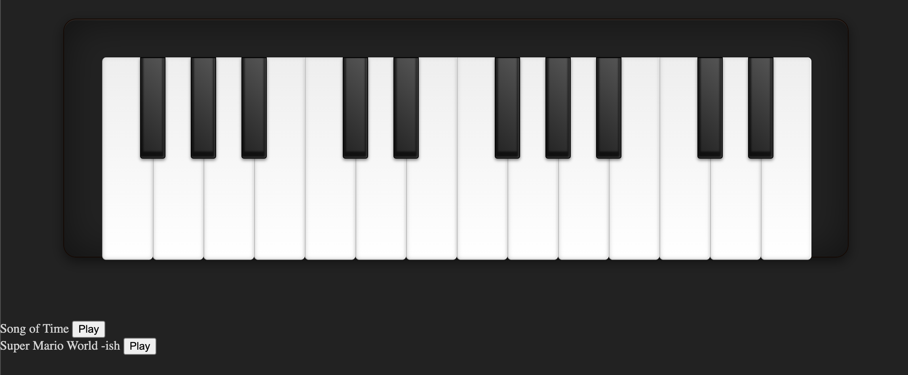

# webaudio-piano

Basic piano in the browser. Result of my experimentations with the [WebAudio API](https://developer.mozilla.org/en-US/docs/Web/API/Web_Audio_API).

All notes are clickable, some are also bound to keyboard keys `1-8`.

Comes with crappy versions of some well know video game songs. They need a screen refresh rate of 60 to make sense (the FPS limiter code should make it work for higher refresh rates).

## References
- CSS for the piano: https://codepen.io/zastrow/pen/kxdYdk
- Generate Sounds Programmatically With Javascript: https://marcgg.com/blog/2016/11/01/javascript-audio/
- Controlling FPS with `requestAnimationFrame`: https://stackoverflow.com/a/19772220
